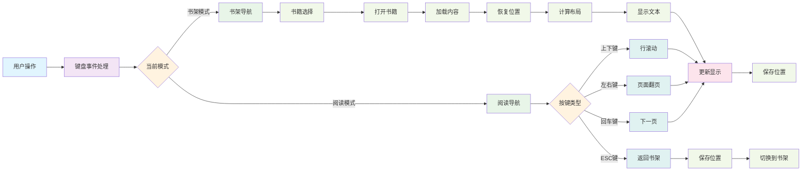

# E-Book Screen 代码详细分析文档

## 1. 概述

ebook_screen.c 是一个功能完整的电子书阅读器实现，提供了书籍浏览和阅读功能。该模块支持多本书籍管理、阅读位置记忆、文本布局计算和精确的滚动控制。

## 2. 主要功能特性

- **书籍浏览界面**：显示书籍列表，支持导航选择
- **阅读界面**：提供舒适的文本阅读体验
- **位置记忆**：每本书独立保存阅读位置
- **自动刷新**：定期扫描目录中的新书籍
- **精确滚动**：支持行级和页面级滚动
- **电池显示**：显示设备电池状态
- **跨平台支持**：同时支持软件模拟和硬件平台

## 3. 核心数据结构

### 3.1 ebook_state_t
主状态结构体，包含整个电子书系统的状态信息：
- 书籍列表管理
- 阅读状态跟踪
- 界面模式控制

### 3.2 page_metrics_t
页面度量信息：
- 字体信息
- 显示尺寸
- 每行字符数和每页行数计算

### 3.3 page_layout_t
页面布局信息：
- 行信息数组
- 当前行索引
- 页面计数

### 3.4 screen_display_t
屏幕显示结构：
- 可见行信息
- 顶部行索引
- 屏幕有效性标志

## 4. 模块架构

### 4.1 界面管理模块
```
create_shelf_ui()        // 创建书架界面
create_reading_ui()      // 创建阅读界面
switch_to_shelf_mode()   // 切换到书架模式
switch_to_reading_mode() // 切换到阅读模式
```

### 4.2 文件系统模块
```
ebook_scan_books()       // 扫描书籍文件
ebook_load_file()        // 加载书籍内容
load_book_position()     // 加载阅读位置
save_book_position()     // 保存阅读位置
```

### 4.3 布局计算模块
```
ebook_init_page_metrics_internal()     // 初始化页面度量
ebook_calculate_line_layout_internal() // 计算行布局
ebook_free_line_layout_internal()      // 释放布局内存
```

### 4.4 显示控制模块
```
ebook_update_shelf_display()    // 更新书架显示
ebook_update_reading_display()  // 更新阅读显示
ebook_update_shelf_selection()  // 更新书架选择高亮
```

### 4.5 导航控制模块
```
ebook_navigate_up()     // 向上导航
ebook_navigate_down()   // 向下导航
ebook_page_up()         // 上一页
ebook_page_down()       // 下一页
ebook_handle_select()   // 处理选择操作
ebook_handle_back()     // 处理返回操作
```

### 4.6 位置管理模块
```
ebook_save_position()   // 保存位置
ebook_load_position()   // 加载位置
ebook_goto_line()       // 跳转到指定行
ebook_goto_page()       // 跳转到指定页
```

## 5. 核心流程分析

### 5.1 初始化流程
1. 创建主界面对象
2. 创建书架和阅读界面容器
3. 扫描书籍目录
4. 初始化定时器（自动扫描）
5. 设置键盘事件回调

### 5.2 书籍浏览流程
1. 显示书籍列表
2. 使用上下键导航选择
3. 按回车键打开选中书籍
4. 自动扫描新书籍并更新列表

### 5.3 阅读流程
1. 加载书籍内容
2. 恢复上次阅读位置
3. 计算文本布局
4. 显示文本内容
5. 处理导航操作
6. 保存阅读位置

### 5.4 位置记忆流程
1. 打开书籍时加载位置
2. 阅读过程中更新位置
3. 退出阅读时保存位置
4. 支持行索引和字符位置两种模式

## 6. 关键技术实现

### 6.1 文本布局计算
通过分析文本内容，将文本分割成适合显示的行，记录每行的起始位置和字符数。

### 6.2 精确滚动控制
实现行级滚动，通过维护屏幕显示缓冲区，实现流畅的滚动体验。

### 6.3 自动书籍扫描
使用LVGL定时器定期扫描书籍目录，自动发现新添加的书籍。

### 6.4 跨平台文件操作
通过条件编译支持软件模拟环境和硬件平台的文件操作。

## 7. 内存管理

### 7.1 文本内容内存
为加载的书籍内容动态分配内存，阅读结束后释放。

### 7.2 布局信息内存
为行布局信息动态分配内存，支持动态扩容。

### 7.3 界面对象内存
由LVGL管理界面对象内存，模块负责创建和销毁。

## 8. 定时器使用

### 8.1 书籍扫描定时器
定期扫描书籍目录，更新书籍列表。

### 8.2 电池显示更新
定期更新电池状态显示。

## 9. 键盘事件处理

### 9.1 书架模式按键
- 上/下键：在书籍列表中导航
- 回车键：打开选中书籍
- ESC键：退出电子书界面

### 9.2 阅读模式按键
- 上/下键：行级滚动
- 左/右键：页面翻页
- 回车键：下一页
- ESC键：返回书架

## 10. 界面设计

### 10.1 书架界面
- 顶部标题显示
- 书籍列表显示（使用LVGL列表组件）
- 底部操作说明

### 10.2 阅读界面
- 顶部显示书籍标题和电池状态
- 中间区域显示文本内容
- 底部显示页面信息和操作说明

## 11. 错误处理和异常情况

### 11.1 文件操作错误
- 文件打开失败处理
- 文件过大处理
- 内存分配失败处理

### 11.2 界面边界处理
- 滚动到顶部/底部的处理
- 空书籍列表处理
- 无效位置处理

## 12. 性能优化

### 12.1 内存使用优化
- 按需分配内存
- 及时释放不用的资源

### 12.2 显示更新优化
- 只在必要时更新界面
- 使用局部更新减少重绘

### 12.3 布局计算优化
- 预计算文本布局信息
- 缓存计算结果

## 13. 可扩展性设计

### 13.1 模块化设计
各功能模块相对独立，便于维护和扩展。

### 13.2 接口设计
提供清晰的函数接口，便于其他模块调用。

### 13.3 配置参数
通过宏定义配置关键参数，便于调整。

## 14. 跨平台兼容性

### 14.1 条件编译
使用条件编译支持不同平台的特定实现。

### 14.2 抽象层设计
文件操作等平台相关功能通过抽象层隔离。

## 15. 注意事项

### 15.1 内存管理
确保所有动态分配的内存在使用完毕后正确释放。

### 15.2 界面生命周期
正确管理界面对象的创建和销毁，避免内存泄漏。

### 15.3 异常处理
妥善处理文件操作和内存分配等可能失败的操作。

## 16. 系统架构图

```mermaid
graph TD
    A[E-Book Screen System] --> B[Screen Management]
    A --> C[UI Components]
    A --> D[File System]
    A --> E[Reading Engine]
    A --> F[Navigation System]
    A --> G[Position Tracking]

    %% Screen Management
    B --> B1[Initialization]
    B --> B2[Deinitialization]
    B1 --> B1A[Create UI Containers]
    B1 --> B1B[Scan Books]
    B1 --> B1C[Start Timer]
    B2 --> B2A[Cleanup Resources]
    B2 --> B2B[Stop Timer]

    %% UI Components
    C --> C1[Shelf UI]
    C --> C2[Reading UI]
    C1 --> C1A[Book List]
    C1 --> C1B[Navigation Indicators]
    C2 --> C2A[Text Display Area]
    C2 --> C2B[Page Info]
    C2 --> C2C[Book Title]
    C2 --> C2D[Battery Indicator]

    %% File System
    D --> D1[Book Scanning]
    D --> D2[File Loading]
    D --> D3[Position Saving]
    D --> D4[Position Loading]
    D1 --> D1A[Directory Scan]
    D1 --> D1B[File Filtering]
    D2 --> D2A[Memory Allocation]
    D2 --> D2B[Content Reading]
    D3 --> D3A[Per-book Position Files]
    D4 --> D4A[Load Saved Positions]

    %% Reading Engine
    E --> E1[Text Layout]
    E --> E2[Line Calculation]
    E --> E3[Screen Display]
    E1 --> E1A[Page Metrics]
    E1 --> E1B[Font Handling]
    E2 --> E2A[Line Breaking]
    E2 --> E2B[Paragraph Detection]
    E3 --> E3A[Text Generation]
    E3 --> E3B[Display Update]

    %% Navigation System
    F --> F1[Keyboard Handling]
    F --> F2[Shelf Navigation]
    F --> F3[Reading Navigation]
    F1 --> F1A[Key Mapping]
    F2 --> F2A[Book Selection]
    F2 --> F2B[List Scrolling]
    F3 --> F3A[Line Scrolling]
    F3 --> F3B[Page Navigation]

    %% Position Tracking
    G --> G1[Per-book Tracking]
    G --> G2[Auto-save]
    G --> G3[Restore Position]
    G1 --> G1A[Character Position]
    G1 --> G1B[Line Index]
    G2 --> G2A[On Navigation]
    G2 --> G2B[On Exit]
    G3 --> G3A[On Book Open]
    G3A --> G3A1[Convert Position]

    %% Data Structures
    A --> H[Data Structures]
    H --> H1[E-Book State]
    H --> H2[Book Entry]
    H --> H3[Page Metrics]
    H --> H4[Page Layout]
    H --> H5[Screen Display]

    %% Timers and Updates
    A --> I[Periodic Updates]
    I --> I1[Book Scan Timer]
    I --> I2[Battery Update]
    I --> I3[Display Refresh]

    classDef module fill:#e1f5fe,stroke:#64b5f6,stroke-width:2px;
    classDef component fill:#f3e5f5,stroke:#9c27b0,stroke-width:1px;
    classDef process fill:#e8f5e8,stroke:#4caf50,stroke-width:1px;

    class A module;
    class B,C,D,E,F,G,H,I module;
    class B1,B2,C1,C2,D1,D2,D3,D4,E1,E2,E3,F1,F2,F3,G1,G2,G3,I1,I2,I3 process;
    class C1A,C1B,C2A,C2B,C2C,C2D,D1A,D1B,D2A,D2B,D3A,D4A,E1A,E1B,E2A,E2B,E3A,E3B,F1A,F2A,F2B,F3A,F3B,G1A,G1B,G2A,G2B,G3A,G3A1,H1,H2,H3,H4,H5 process;
```



## 17. 功能模块交互图


